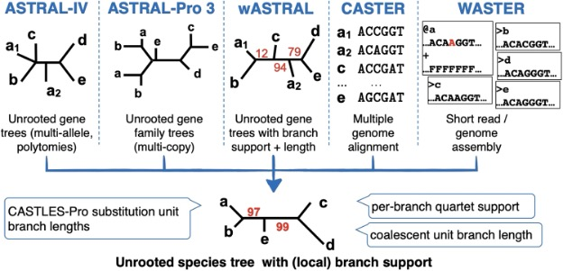

# Summary colascent based species tree inference in ASTRAL

## 1. Software we'll cover in lab today:

ASTRAL [website](https://github.com/chaoszhang/ASTER)

This updated `ASTER` package includes multiple ASTRAL-like tools that can accommodate gene duplications, gene tree uncertainties, etc.



## 2. Getting onto the server

We will be using the ASTRAL version available on HiPerGator. Note that this is not the latest version of astral. If you need to use some of the recently enabled functions in the future, you can install aster using conda (see tutorial: https://github.com/chaoszhang/ASTER/blob/master/tutorial/astral4.md).

By now, you should be able to:

1. Log on to Hipergator using `ssh`
2. `cd` into your working directory (this is either `/ufrc/bot6276/<username>/`, or a folder in your PI's group)
3. Make a new directory for this lab using `mkdir` and `cd` into it.
4. Next, make two additional directories inside this directory:
  - `mkdir Lab3`
5. Copy the files for today's lab to your new directories.

```
cp /blue/bot6276/share/Lab3files/* .
```
  
Check the contents of the directories using `ls` to make sure everything copied properly.
```
song_mammals.424.gene.tre
astral.pthreads.sh
```

## 3. ASTRAL background

ASTRAL is a summary method that will estimate an unrooted species tree from a set of input, unrooted gene trees. ASTRAL is statistically consistent under the multi-species coalescent (meaning that it is theoretically guaranteed to converge on the correct solution as more data are added). The input trees can be unresolved (i.e., have polytomies), contain missing taxa, or multiple tips with the same taxon name. There are various options available for multi-locus bootstrapping and other modifications (see: https://github.com/chaoszhang/ASTER), but here we will focus on the basics of how to use the software.

ASTRAL is a java program that has already been installed on HPG and is easy to use. Another handy feature on HPG is that the command `module load astral` will automatically load the most recent version of the software that has been installed. The current version (as of March 2019) is version 5.6.2, which corresponds to ASTRAL-II. You can always load a specific version by modifying the load command as: `module load astral/4.10.7`, substituting the version number as appropriate to get the one you want. This is especially useful if a beta version has been released that is not the default version loaded with `module load astral`, but you want to test it out.

## 4. The ASTRAL submission script and input file

Let's start by looking at the submission script for ASTRAL: `astral.pthreads.slurm`.

Notice that there's a line we haven't seen in any our scripts before, which allocates memory to ASTRAL (technically, to any java application you have running, but since ASTRAL is the only one you'll run with this script, you can think of it as being specific to ASTRAL).
```
# To allocate memory for ASTRAL: 
export _JAVA_OPTIONS="-Xmx300M"
#export _JAVA_OPTIONS="-Xmx2g"
```
The second command is commented out so that everyone in our class does not request 2GB of memory at the same time, but this is how you would call larger amounts of memory if you had a bigger dataset.

The `astral` command actually executes the program, and its flags are pretty simple: designating an input file, an output file, and where the log file should be saved. 

Open the input file, `song_mammals.424.gene.tre` in TextWrangler and take a look at it. Confirm to yourself that this file contains a set of Newick-formatted gene trees. 

1. How many gene trees are there in the input file? _______________________________

## 5. Running ASTRAL and working with output

Go ahead and run ASTRAL by submitting your job to the queue:
```
sbatch astral.pthreads.sh
```
Remember that you can check the status of your job with this command; ASTRAL may finish so quickly that there's no job listed by the time you enter this.
```
squeue -u <GatorID>
```
Take a look at the output file in TextWrangler. What does it look like?

Next open up the log file (also in TextWrangler) and use it to answer the following questions:

2. How did ASTRAL root the gene trees and species tree? Any guesses why it used that taxon? 

3. How many quartet trees (4-taxon trees) are present amongst all of your input gene trees? 

The normalized quartet score is the proportion of quartets present in the input gene trees that are present in the species tree. It is a value between 0 and 1, the higher the better.

4. What is the value of the normalized quartet score for this analysis? What does this value mean in terms of discordance between your gene trees? In other words, does higher/lower mean more or less discordance?

The optimization score is related to the values above, it is the raw number of quartets in the gene trees that is found in the species tree.

5. Open the output tree in FigTree, and set the branch labels to show the values from ASTRAL. In general, what these values are like across the tree? 

A description of these support values and what they mean can be found here: http://eceweb.ucsd.edu/~smirarab/2016/04/15/localpp.html. This post summarizes a paper by two of the ASTRAL authors that describes how local branch support values are described from quartet frequencies: Sayyari and Mirarab. 2016. Fast Coalescent-Based Computation of Local Branch Support from Quartet Frequencies. MBE 33(7): 1654-1668. Basically, the values indicate support for a quadripartition around a particular branch, not a bipartition, which is what is commonly used to calculate these values.

This paper also discusses branch lengths. Note that the branch lengths on this tree are in coalescence units and as such are a measure of discordance among gene trees; they are not analogous to branch lengths in a typical ML tree, for example, which are shown in substitutions/site.
